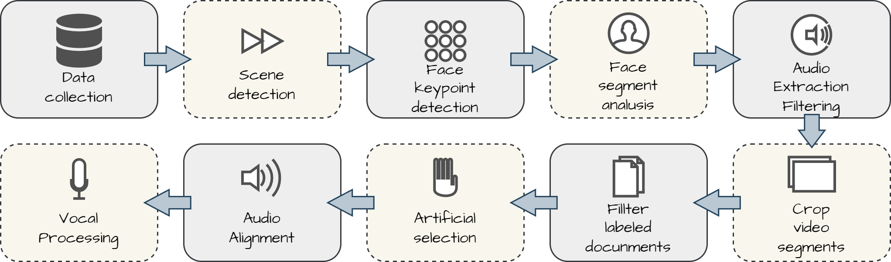

# MM-AC-Dataset
## A High-Quality Multi-Modal Dataset for Cartoon Portrait Animation

Creating high-quality animations for cartoon portraits requires extensive datasets that capture the nuances of multimodal interactions, including visual, auditory, and textual information. Current datasets often lack the richness and diversity needed to train advanced models for this purpose. To address this gap, we present HQMM-CPA, a high-quality multimodal dataset specifically designed for cartoon portrait animation. HQMM-CPA comprises over 3,000 annotated cartoon portraits, each accompanied by synchronized audio and face 68 keypoints annotation. Our dataset includes diverse expressions, poses, and speaking styles, captured under various conditions, to facilitate the development of robust and versatile animation models. We detail the dataset collection, annotation process, and its multimodal features. Furthermore, we demonstrate the effectiveness of HQMM-CPA by training state-of-the-art models and showcasing significant improvements in animation quality and realism. This dataset opens new avenues for research in cartoon animation and multimodal learning, providing a valuable resource for the community.

## HQMM-APC dataset download [link](https://drive.google.com/file/d/1jF_7OblhTFXZ2JgS_WV-dFuaoATm1LT3/view?usp=drive_link) (contains Audio file, key point annotation, metadata, video file requires you to apply for access separately)
For complete video dataset download please contact us through this Email: xushuolin420@gmail.com

https://github.com/Xushuolin/HQMM-APC-Dataset/assets/121299261/5e355ee5-53c9-4f4b-bd39-951da483521a

## Dataset content
Our dataset contains high-quaity video, keypoint, and audio clips for cartoon portrait animation.

https://github.com/Xushuolin/HQMM-APC-Dataset/assets/121299261/79cdd9b5-f253-4650-bce1-da6f848c3d2c

The dataset includes some anthropomorphic character faces in addition to regular faces

https://github.com/Xushuolin/HQMM-APC-Dataset/assets/121299261/e887229a-f1b3-4098-b36e-737dc6dfd1b5

## Data collection and processing pipeline 

We have developed a semi-automated data processing pipeline to extract the regions we need from the raw video and filter the data using the facial keypoint annotation results.

## Experiment
We performed a simple fine-tuning training on [Aniportrait](https://github.com/Zejun-Yang/AniPortrait) using our dataset, without changing any of the original parameters of the model. It is not difficult to consider the results shown on our given case to see that the fine-tuning produces a more reasonable and stable picture. In particular, the local generation of eyes and mouths is particularly good. 
### Pre-fine-tune
https://github.com/Xushuolin/HQMM-APC-Dataset/assets/121299261/9262d732-e8ff-42f8-98bc-cda96f0bada9
### Fine tuned
https://github.com/Xushuolin/HQMM-APC-Dataset/assets/121299261/ce28e68b-0f8a-40b6-9579-0c8c400eb888
### Pre-fine-tune
https://github.com/Xushuolin/HQMM-APC-Dataset/assets/121299261/6895a6e1-f628-435d-a909-41d24648a2c6
### Fine tuned
https://github.com/Xushuolin/HQMM-APC-Dataset/assets/121299261/f697a1b7-a83d-4659-a050-db8ae370c625

